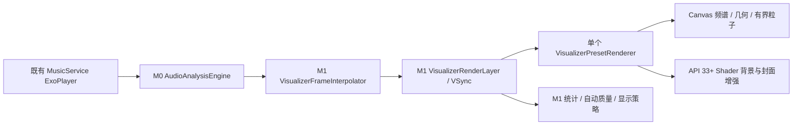

# Phonk Visualizer M2 验收报告

范围为四套真实音频驱动预设、预览舞台、配置持久化、AGSL 增强与 Canvas 降级。正式沉浸播放器、导航重构及标准播放器周围的特效属于 M3，本次不修改 PlayerPagerArtwork、PlayerBackdrop、PlayerScreen 的转场。

## 本地准备与基线

从 app 分支本地 2097b41 / efa03dd 开始，读取 M1 报告、证据和采集/渲染/播放器状态来源。根目录没有 M0 报告。原有 MarkdownText.kt 与 UpdateDialog.kt 的修改保留，最终不纳入 M2 提交，不推送。

M1 与 M0 完整 155 项设备结果均为 138 通过、14 失败、3 跳过，13 个失败方法共有。集合并不完全相同；M1 独有采集能量失败，M0 独有 UserCapabilities 滚动失败。M1 的最后一次完整复测挂在下载取消测试，并经人工停止；不能把它称为完整通过。详情和原始 XML 见 [M1 报告](PHONK_VISUALIZER_M1.md)。本次保留这些测试的断言与账户前置条件。

## 架构与生命周期



没有新播放器、采集器、预设独立时钟或网络音频上传。RenderLayer 增加可选 renderer 输入，在既有 withFrameNanos 循环中更新动画；默认路径保留 M1 调试频谱。预设切换保持同一 audioSessionId，释放旧渲染器，单层 240ms 淡入保留背景与封面，不使用双重采集或双套动画循环。

VisualizerEffectState 使用固定 96 粒子与 4 冲击波池。输入为平滑帧、generation、真实 Kick/Transient 计数和实测 dt。激活以当前事件计数为起点，切换不重放旧事件；切歌 generation 清空旧状态。故障持续 75ms，冷却 450ms；减少动态效果时冷却 1500ms，并降低突发强度和粒子数。封面最大缩放 1.08（Bass 上限 1.12），震动仅作用于封面，文字及控制不随其移动。显示增益用于可视化映射，不改变播放音量或 M0 检测阈值。

绘制 revision 仅由 Canvas / graphicsLayer 读取，不让 PlayerScreen 订阅高频帧。Path、Stroke、Shader、Brush、数组与封面请求复用。Shader 背景使用 240dp / 144dp 的离屏层，频谱、封面和边框保留舞台原分辨率。Dark 的封面 RGB 使用两个预先缓存的 RenderEffect，以真实瞬态选择，避免每帧创建 native effect。封面来自 vm.currentSong，使用已有 Coil 缓存机制，切歌 240ms 过渡；加载失败显示音符。一次加载后在工作线程采样 144 个像素取背景色，不重复解码，也不回收 Coil 所持有的图像。

暂停衰减后停止帧循环；后台/关闭/采集失败清零并撤销刷新偏好，释放 Shader 引用与 FrameMetrics 监听。inactive 绘制不会重新创建 Shader。减少动态效果同时尊重用户选项及 ValueAnimator.areAnimatorsEnabled。无 AGSL、非硬件画布、GPU 创建失败和低画质均使用 Canvas；音乐继续播放。

Compose preferredFrameRate 仍为主要请求。该设备在预览时限制应用为 60Hz，因此增加仅预览活动期间的窗口 preferredRefreshRate 兜底请求。请求不改变全局设置，不强制 modeId；M1 温控/节能/质量上限先作用于请求。原值由作用域保存并恢复，其他代码改变该值时保留其他所有者的修改。系统仍可以拒绝高刷新请求。

## 四套效果

| 预设 | 已实现视觉与音频响应 |
|---|---|
| Orbit Spectrum | 圆形封面、96/72/48/32 径向柱、双环、封面取色背景、Bass 呼吸、Kick 外环、轻缓粒子 |
| Neon Pulse | 方形封面、48/32/24/16 柱每侧镜像频谱、白色边框、蓝紫菱形、电流、Kick 外扩环、Bass 缩放、Treble 粒子与电光、GPU 光晕 |
| Bass Impact | 橙金方形封面、56/36/24/12 径向线、低音缩放回弹、Kick 冲击波、轻微封面震动、GPU 径向扭曲、底部频谱 |
| Dark Glitch | 黑白封面、红色边光、扫描线、碎片纹理、短暂真实封面水平切片、受冷却限制的瞬态 RGB 偏移、GPU 噪点、Bass 暗红光晕与频谱 |

ULTRA / HIGH 降低粒子数量及 Shader 背景分辨率；BALANCED / ECO 关闭辅助 Shader，保留各预设核心识别元素，继续复用 M1 的 60 / 30 FPS 上限。画质手动上限与自动档位取较低质量，不覆盖用户保存的 FPS。

## 配置与入口

播放页现有“音乐可视化”入口保留音频调试，新增“打开特效预览”。四套选择、当前歌曲封面、舞台及四套切换置于前方，默认只显示音频状态及低音/鼓点。目标/Canvas/显示 FPS、画质、详细性能与参数收进展开项，优先展示实际效果。

DataStore 保存预设、全局/低音/频谱/光晕强度、粒子密度、动态/扭曲/故障强度、减少动态效果及手动画质。enabled 与 adaptiveQuality 映射到 M0/M1 原有键，FPS 沿用原键，不创建冲突设置。参数写入/读取均规范化，NaN/Infinity 恢复默认，越界数值夹紧。默认采集关闭。逐曲记忆及正式设置导航属于后续 M3。

## 可复现环境与命令

RMX5060 / Android 16，serial 5PXS9TSKLFIJAU9T，USB 供电、电量 100%，隔离包 com.bileizhen.currentmusic.verification。不修改系统音量、刷新率、温控和账户信息。此前工程验证使用过合成 WAV，相关截图和长测仅为历史证据。用户要求改用 THIS FEELING 后，已停止合成播放并从 M2 真机测试中删除 WAV 生成器、localhost 服务和虚构封面。当前测试通过 MusicRepository 搜索 THIS FEELING / MY!LANE，交给 PlayerController.playList 和原 MusicService 播放，显示原曲封面；搜不到或播放失败时报告失败，不替换音源。m2.song / m2.artist 参数允许指定同名歌曲的确切版本，不写死歌曲 ID，不修改音质。测试结束恢复原队列、播放状态及视觉设置。

Windows 使用 M: ASCII 映射及 M1 已验证的 JDK。最初从中文路径启动 JVM 测试时出现全部 ClassNotFoundException；切回映射后执行断言通过，此为环境问题。开发中的绘制接收者和编译快照错误已修正。一次主机 Instrumentation 只收到开始状态提前结束，设备端随后完成；保存该次不完整 XML，不算通过。短测复测通过；长测虽增加心跳仍出现主机结果流不完整，已另存设备端失败栈，不能以心跳宣称修复。

```powershell
$env:JAVA_HOME='C:\Program Files\Android\openjdk\jdk-21.0.8'
$env:TEMP='D:\Android\tmp'; $env:TMP=$env:TEMP
$env:ANDROID_SERIAL='5PXS9TSKLFIJAU9T'
Set-Location M:\
# 以下 worker/JVM 参数用于全部门禁与设备命令。
.\gradlew.bat :app:assembleDebug :app:testDebugUnitTest :app:lintDebug `
 -PisolatedDebug=true --no-daemon --max-workers=1 `
 '-Dorg.gradle.jvmargs=-Xmx1024m -XX:+UseSerialGC -XX:CICompilerCount=2 -XX:HeapBaseMinAddress=8g -Dfile.encoding=UTF-8' `
 '-Pkotlin.compiler.execution.strategy=in-process' '-Pkotlin.incremental=false'
.\gradlew.bat :app:connectedDebugAndroidTest -PisolatedDebug=true `
 '-Pandroid.testInstrumentationRunnerArguments.class=io.github.currencortex.music.VisualizerPresetDeviceTest#allPresetsAndLifecycle' `
 '-Pandroid.testInstrumentationRunnerArguments.m2.song=THIS FEELING' `
 '-Pandroid.testInstrumentationRunnerArguments.m2.artist=MY!LANE' `
 '-Pandroid.testInstrumentationRunnerArguments.timeout_msec=1800000'
# 同时在另一终端运行；结束时撤销 timestats 开关。
.\scripts\measure_visualizer_surface_frames_m2.ps1 -Serial $env:ANDROID_SERIAL -OutputDirectory visualizer-m2-evidence/latency-long -MaximumSeconds 1350
.\scripts\summarize_visualizer_surface_frames_m2.ps1 -InputDirectory visualizer-m2-evidence/latency-long -OutputPath visualizer-m2-evidence/presented-long.csv
```

原始窗口文件完整保存在 latency-long.zip / latency-four.zip / latency-final-short.zip，工作目录的同名文件夹保留但不纳入提交。原始设备日志的空白格式保留，不作为源代码 whitespace 门禁。

呈现统计来自 SurfaceFlinger 第二列 actualPresent 纳秒值，排除 0、INT64_MAX 和重复旧窗口。窗口每约 5 秒采集，其环形缓冲只覆盖约 1–4 秒，不能冒充完整连续追踪。平均 P95/P99 为各滚动窗口平均，不是整段合并分位数。GPU 为 Window FrameMetrics GPU_DURATION，缺失时为未知；Canvas CPU 仅覆盖主绘制层，不包括 GPU 或整个进程。

依据官方 [AGSL 使用文档](https://developer.android.com/develop/ui/views/graphics/agsl/using-agsl)、[FrameMetrics](https://developer.android.com/reference/android/view/FrameMetrics) 和 [窗口刷新率请求](https://developer.android.com/media/optimize/performance/frame-rate)。

## 阶段检查

- M2.0 / M2.1：Orbit 编译、单元测试和真机集成/生命周期通过，证据 [orbit-integration.xml](visualizer-m2-evidence/orbit-integration.xml)、[初始效果单测](visualizer-m2-evidence/effects-m2-0.xml)。第一版舞台裁剪问题通过截图定位并扩大预览修正。
- M2.2–M2.5：四套独立 30 秒采样、封面加载、会话保持、Shader 编译、ECO 基础绘制和生命周期通过；窗口兜底前结果 [four-pre-window.xml](visualizer-m2-evidence/four-pre-window.xml)，该次呈现约 60Hz。
- M2.6：最终长测、回归和呈现数据由以下最终结果节记录；进行中的测试不计为通过。

## 已知兼容与范围限制

- 没有 API 26–32 真机/模拟器，不以代码 guards / Lint 替代旧系统实测。
- 不保证所有温控、设备及系统政策下达到 120 FPS；M1 基础频谱的 120Hz 数据不作为 M2 四套预设证据。
- 系统动画偏好被可靠读取时会减少强动态；本设备测试环境已观察到该路径。
- Window/GPU 指标与实际呈现分开，未做逐对象分配分析或 GPU 利用率 trace，不宣称零分配或绝对无泄漏。
- DLNA/MV 不采集；预设不处理房间协议。真实外部房间及 DLNA 设备契约需对应条件，不用本地音源替代远端服务验证。
- M3 建议复用此 renderer / config，在标准圆形封面周围添加 Orbit，并独立建立可横屏、控制自动隐藏的沉浸舞台；保持已有 pager 转场语义，先处理既有回归前置条件。

## 最终结果

当前四套预设已有实际画面；原曲短测通过。M2.6 的完整长时与兼容验收仍有待办，本报告不将短测等同于完整发布验收。

| 检查 | 实际结果 | 证据 |
|---|---|---|
| assembleDebug / assembleDebugAndroidTest | 通过 | final-build.log |
| testDebugUnitTest | 269 项通过，0 失败；其中新增效果单测 23 项 | unit-summary.json / effects-final.xml |
| lintDebug | 通过，0 errors、49 warnings、7 hints | lint-final.xml |
| 原曲四预设与生命周期 / DataStore / UI | 5 项通过，0 失败，RMX5060 API 36 | this-feeling-final.xml / this-feeling-final-build.log |
| 原曲 15 分钟稳定性 | 本轮未执行 | 不使用历史合成音源代替 |
| 完整既有设备回归 | 本轮未重跑全部 155 项；旧基线见前文 | 原有失败未隐藏或改为跳过 |
| API 26–32 设备 / 完整 M2 120 FPS | 未完成验收 | 见兼容限制及历史呈现记录 |

真实歌曲由现有搜索返回：ID 1897255962，This Feeling，my!lane，时长 163829ms。四套各播放同一原曲 10–40 秒段约 30 秒，记录最大 Kick 计数依次 48 / 49 / 48 / 45；不是人工周期。Neon / Bass / Dark 的 AGSL 编译并运行，Orbit 的 Canvas 运行；ECO 回退未改变音频会话。真实 FFT/波形、封面、事件与生命周期记录在 [this-feeling-final.jsonl](visualizer-m2-evidence/this-feeling-final.jsonl)。采样约 18–19Hz，与 VSync 绘制解耦。

此次确认暂停/恢复、后台、实际熄屏、Seek、Activity 重建、关闭预览与窗口偏好恢复。screen-off 记录 interactive=false、running=false、preferenceFps=0；关闭后音乐仍播放。旋转测试仅确认时钟及资源恢复：**横屏截图中原有底部弹窗内容被裁剪，横屏预览布局未验收**，不能把通过的生命周期断言称作横屏视觉通过。正式横屏沉浸舞台属于 M3；应先修正预览高度和截图等待条件。

第一次原曲尝试的额外详情请求超时（this-feeling-detail-timeout.log），改为直接使用搜索结果的完整元数据后播放成功。第二次四套均运行，但测试在播放段结束后等待新的 75ms 故障短闪失败（this-feeling-first.xml）；最终保留真实触发断言，改为播放过程中观察，5 项通过。glitch-event 的 JSON 记录发生在内存统计之后，包络已衰减为 0；通过的是采样时的真实短闪断言，**静态截图不能证明 75ms RGB/切片已呈现**，仍需视觉录屏补验。当前测试环境系统减少动态路径为 true，未覆盖所有强动态视觉组合。

历史合成音源的 15 分钟绘制循环已走完，但随后物理熄屏失败；主机 UTP 结果流也不完整，见 long-native-failure.log 与 long-utp-incomplete.xml，整体不计通过。本次原曲短测使用真实 Power 键并通过物理熄屏断言，不覆盖或删除旧失败。历史呈现分段约 60 FPS；长测采样窗口混合平均约 61.3 FPS，窗口环形缓冲不覆盖全段，不宣称四套稳定 120 FPS。用户改以实际效果为优先后，本轮没有继续追逐帧率，也没有启动合成音源。

原曲真机截图：

- [Neon Pulse](visualizer-m2-evidence/this-feeling-neon-pulse.png)
- [Orbit Spectrum](visualizer-m2-evidence/this-feeling-orbit-spectrum.png)
- [Bass Impact](visualizer-m2-evidence/this-feeling-bass-impact.png)
- [Dark Glitch](visualizer-m2-evidence/this-feeling-dark-glitch.png)

下一步先修正横屏预览裁剪、补真实短闪录屏和原曲长时验证；可获得旧系统设备后补 Canvas 兼容验收。M3 正式播放器接入应复用当前模块，保留 PlayerPagerArtwork 转场，并逐步建立沉浸舞台及设置导航。

## 修改文件清单

- `core/visualizer/`：新增 EffectConfig、EffectState、ShaderPolicy、RefreshPreference；修改 FrameInterpolator、PerformanceMonitor。
- `feature/visualizer/`：新增 PresetPreview、EffectControls 与 render/ 内 PresetRenderer、ShaderEffectRenderer；修改 AudioAnalysisDebugDialog、RenderLayer、RenderState、WindowMetrics。
- `data/settings/MusicSettingsRepository.kt`、`data/visualizer/VisualizerRenderSettings.kt`、`feature/player/PlayerViewModel.kt`：保存参数及预览状态接入。
- `src/test/.../VisualizerEffectsTest.kt`：23 项对应算法/边界/资源策略单测。
- `src/androidTest/.../VisualizerPresetDeviceTest.kt`、`VisualizerEffectsSettingsTest.kt`、`VisualizerDebugUiTest.kt`、`VisualizerSettingsTest.kt`：原曲、配置、预览及生命周期验证。
- `scripts/*visualizer*m2*`：呈现帧时间提取与阶段过滤；`visualizer-m2-evidence/`：原始验证证据；根目录及 assets/legal 的 PRIVACY.md：新增本地选项说明。

未改动音频核心、原封面转场或原有更新弹窗工作；没有提交账户信息、音频采集内容或播放 URL。
